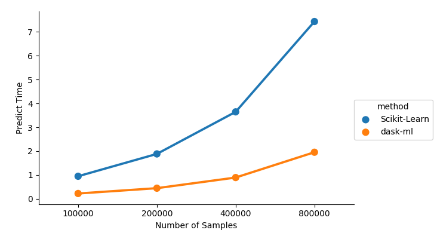

*This work is supported by [Anaconda Inc](http://anaconda.com/) and the Data
Driven Discovery Initiative from the [Moore
Foundation](https://www.moore.org/).*

[dask-ml][dask-ml] 0.4.1 was released today with a few enhancements. See the
[changelog][changelog] for all the changes from 0.4.0.

Conda packages are available on conda-forge

    $ conda install -c conda-forge dask-ml
    
and wheels and the source are available on PyPI

    $ pip install dask-ml

I wanted to highlight one change, that touches on a topic I mentioned in my
first post on [scalable Machine Learning](scalable-ml-01). I discussed how, in
my limited experience, a common workflow was to train on a small batch of data
and predict for a much larger set of data. The training data easily fits in
memory on a single machine, but the full dataset does not.

A new meta-estimator, [`ParallelPostFit`][parallel-post-fit] helps with this
common case. It's a meta-estimator that wraps a regular scikit-learn estimator,
similar to how `GridSearchCV` wraps an estimator. The `.fit` method is very
simple; it just calls the underlying estimator's `.fit` method and copies over
the learned attributes. This means `ParalellPostFit` is not suitable for
*training* on large datasets. It is, however, perfect for post-fit tasks like
`.predict`, or `.transform`.


As an example, we'll fit a scikit-learn `GradientBoostingClassifier` on a small
in-memory dataset.

```python
>>> from sklearn.ensemble import GradientBoostingClassifier
>>> import sklearn.datasets
>>> import dask_ml.datasets

>>> X, y = sklearn.datasets.make_classification(n_samples=1000,
...                                             random_state=0)
>>> clf = ParallelPostFit(estimator=GradientBoostingClassifier())
>>> clf.fit(X, y)
ParallelPostFit(estimator=GradientBoostingClassifier(...))
```

Nothing special so far. But now, let's suppose we had a "large" dataset for
prediction. We'll use `dask_ml.datasets.make_classification`, but in practice
you would read this from a file system or database.

```python
>>> X_big, y_big = dask_ml.datasets.make_classification(n_samples=100000,
                                                        chunks=1000,
                                                        random_state=0)
```

In this case we have a dataset with 100,000 samples split into blocks of 1,000.
We can now predict for this large dataset.


```python
>>> clf.predict(X)
dask.array<predict, shape=(10000,), dtype=int64, chunksize=(1000,)>
```

Now things are different. `ParallelPostFit.predict`, `.predict_proba`, and
`.transform`, all return dask arrays instead of immediately computing the
result. We've built up task graph of computations to be performed, which allows
dask to step in and compute things in parallel. When you're ready for the
answer, call `compute`:

```python
>>> clf.predict_proba(X).compute()
array([[0.99141094, 0.00858906],
       [0.93178389, 0.06821611],
       [0.99129105, 0.00870895],
       ...,
       [0.97996652, 0.02003348],
       [0.98087444, 0.01912556],
       [0.99407016, 0.00592984]])
```

At that point the dask scheduler comes in and executes your compute in parallel,
using all the cores of your laptop or workstation, or all the machines on your
cluster.

`ParallelPostFit` "fixes" a couple of issues in scikit-learn outside of
scikit-learn itself

- [parallel predict](https://github.com/scikit-learn/scikit-learn/issues/7448)
- [parallel transform](https://github.com/scikit-learn/scikit-learn/issues/7635)

If you're able to depend on dask and dask-ml, consider giving `ParallelPostFit`
a shot and let me know how it turns out. For estimators whose predict is
relatively expensive and not already parallelized, `ParallelPostFit` can give
a nice [performance boost][performance].



Even if the underlying estimator's `predict` or `tranform` method is cheap or
parallelized, `ParallelPostFit` does still help with distributed the work on all
the machines in your cluster, or doing the operation out-of-core.

Thanks to all the contributors who worked on this release.

[dask-ml]: http://dask-ml.readthedocs.io/en/latest/
[changelog]: http://dask-ml.readthedocs.io/en/latest/changelog.html
[parallel-post-fit]: http://dask-ml.readthedocs.io/en/latest/modules/generated/dask_ml.wrappers.ParallelPostFit.html#dask_ml.wrappers.ParallelPostFit
[performance]: http://dask-ml.readthedocs.io/en/latest/auto_examples/plot_parallel_postfit.html#sphx-glr-auto-examples-plot-parallel-postfit-py
