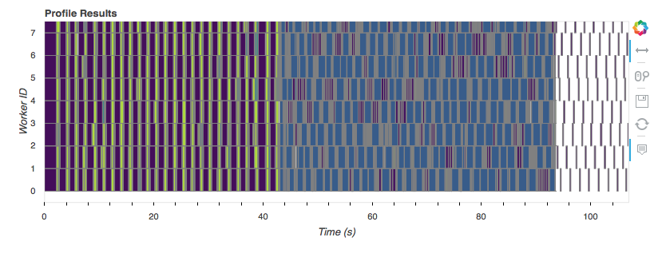
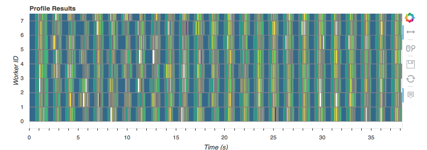

*This work is supported by [Anaconda, Inc.](https://www.anaconda.com/) and the
Data Driven Discovery Initiative from the [Moore Foundation](https://www.moore.org/).*

This is part two of my series on scalable machine learning.

- [Small Fit, Big Predict](scalable-ml-01)
- [Scikit-Learn Partial Fit](scalable-ml-02)

You can download a notebook of this post [here][notebook].

---

Scikit-learn supports out-of-core learning (fitting a model on a dataset that
doesn't fit in RAM), through it's `partial_fit` API. See
[here](http://scikit-learn.org/stable/modules/scaling_strategies.html#scaling-with-instances-using-out-of-core-learning).

The basic idea is that, *for certain estimators*, learning can be done in
batches. The estimator will see a batch, and then incrementally update whatever
it's learning (the coefficients, for example). [This
link](http://scikit-learn.org/stable/modules/scaling_strategies.html#incremental-learning)
has a list of the algorithms that implement `partial_fit`.

Unfortunately, the `partial_fit` API doesn't play that nicely with my favorite
part of scikit-learn,
[pipelines](http://scikit-learn.org/stable/modules/pipeline.html#pipeline),
which we discussed at length in [part 1](scalable-ml-01). For pipelines to work,
you would essentially need every step in the pipeline to have an out-of-core
`partial_fit` version, which isn't really feasible; some algorithms just have to
see the entire dataset at once. Setting that aside, it wouldn't be great for a
user, since working with generators of datasets is awkward compared to the
expressivity we get from pandas and NumPy.

Fortunately, we *have* great data containers for larger than memory arrays and
dataframes: `dask.array` and `dask.dataframe`. We can

1. Use dask for pre-processing data in an out-of-core manner
2. Use scikit-learn to fit the actual model, out-of-core, using the
   `partial_fit` API

And with a little bit of work, all of this can be done in a pipeline. The rest
of this post shows how.

## Big Arrays

If you follow along in the [companion notebook][notebook], you'll see that I
generate a dataset, replicate it 100 times, and write the results out to disk. I
then read it back in as a pair of `dask.dataframe`s and convert them to a pair
of `dask.array`s. I'll skip those details to focus on main goal: using
`sklearn.Pipeline`s on larger-than-memory datasets. Suffice to say, we have a
function `read` that gives us our big `X` and `y`:

```python
X, y = read()
X
```

    dask.array<concatenate, shape=(100000000, 20), dtype=float64, chunksize=(500000, 20)>
  
  
```python
y
```

    dask.array<squeeze, shape=(100000000,), dtype=float64, chunksize=(500000,)>


So `X` is a 100,000,000 x 20 array of floats (I have float64s, you're probably
fine with float32s) that we'll use to predict `y`. I generated the dataset, so I
know that `y` is either 0 or 1. We'll be doing classification.

```python
(X.nbytes + y.nbytes) / 10**9
```

    16.8

My laptop has 16 GB of RAM, and the dataset is 16.8 GB. We can't simply read the
entire thing into memory. We'll use dask for the preprocessing, and scikit-learn
for the fitting. We'll have a small pipeline

1. Scale the features by mean and variance
2. Fit an SGDClassifier

I've implemented a `daskml.preprocessing.StandardScaler`, using dask, in about
40 lines of code (see [here](https://github.com/dask/dask-ml/blob/9e85ba282a93c0f62afbe68dabe088fbd59ada40/daskml/preprocessing/data.py#L8)).
The scaling will be done completely in parallel and completely out-of-core.

I *haven't* implemented a custom `SGDClassifier`, because that'd be much more
than 40 lines of code. Instead, I've put together a small wrapper that will use
scikit-learn's `SGDClassifier.partial_fit` to fit the model out-of-core (but not
in parallel).

```
from daskml.preprocessing import StandardScaler
from daskml.linear_model import BigSGDClassifier  # The wrapper

from dask.diagnostics import ResourceProfiler, Profiler, ProgressBar
from sklearn.pipeline import make_pipeline
```

As a user, the API is the same as `scikit-learn`. Indeed, it *is* just a regular
`sklearn.pipeline.Pipeline`.

```python
pipe = make_pipeline(
    StandardScaler(),
    BigSGDClassifier(classes=[0, 1], max_iter=1000, tol=1e-3, random_state=2),
)
```

And fitting is identical as well: `pipe.fit(X, y)`. We'll collect some
performance metrics as well, so we can analyze our parallelism.

```python
%%time
rp = ResourceProfiler()
p = Profiler()


with p, rp:
    pipe.fit(X, y)
```

    CPU times: user 2min 38s, sys: 1min 44s, total: 4min 22s
    Wall time: 1min 47s

And that's it. It's just a regular scikit-learn pipeline, operating on a
larger-than-memory data. `pipe` has has all the regular methods you would
expect, ``predict``, ``predict_proba``, etc. You can get to the individual
attributes like ``pipe.steps[1][1].coef_``.

One important point to stress here: when we get to the `BigSGDClassifier.fit`
at the end of the pipeline, everything is done serially. We can see that by
plotting the `Profiler` we captured up above:



That graph shows the tasks (the rectangles) each worker (a core on my laptop)
executed over time. Workers are along the vertical axis, and time is along the
horizontal. Towards the start, when we're reading off disk, converting to
`dask.array`s, and doing the `StandardScaler`, everything is in parallel. Once
we get to the `BigSGDClassifier`, which is just a simple wrapper around
`sklearn.linear_model.SGDClassifier`, we lose all our parallelism*.

The predict step *is* done entirely in parallel.

```python
with rp, p:
    predictions = pipe.predict(X)
    predictions.to_dask_dataframe(columns='a').to_parquet('predictions.parq')

```



That took about 40 seconds, from disk to prediction, and back to disk on 16 GB
of data, using all 8 cores of my laptop.

## How?

When I had this idea last week, of feeding blocks of `dask.array` to a
scikit-learn estimator's `partial_fit` method, I thought it was pretty neat.
Turns out Matt Rocklin already had the idea, and implemented it in dask, two
years ago.

Roughly speaking, the implementation is:


```python
class BigSGDClassifier(SGDClassifier):
    ...
    
    def fit(self, X, y):
        # ... some setup
        for xx, yy in by_blocks(X, y):
            self.partial_fit(xx, yy)
        return self
```

If you aren't familiar with `dask`, its arrays are composed of many smaller
NumPy arrays (blocks in the larger dask array). We iterate over the dask arrays
block-wise, and pass them into the estimators `partial_fit` method. That's exactly
what you would be doing if you were using, say, a generator feed NumPy arrays to
the `partial_fit` method. Only you can manipulate a `dask.array` like regular
NumPy array, so things are more convenient.


## Some Challenges

For our small pipeline, we had to make two passes over the data. One to fit the
``StandardScaler`` and one to fit the ``BigSGDClassifier``. In general, with
this approach, we'll have to make one pass per stage of the pipeline, which
isn't great. I *think* this is unavoidable with the current design, but I'm
considering ways around it.

## Recap

We've seen *a* way to use scikit-learn's existing estimators on
larger-than-memory dask arrays by passing the blocks of a dask array to the
`partial_fit` method. This enables us to use `Pipeline`s on larger-than-memory
datasets.

Let me know what you think. I'm pretty excited about this because it removes
some of the friction around using sckit-learn Pipelines with out-of-core
estimators. In [`dask-ml`][daskml], I've implemented similar wrappers for

- SGDRegressor
- PassiveAggressiveClassifier
- PassiveAggressiveRegressor
- Perceptron
- MPLClassifier
- MLPRegressor
- MiniBatchKMeans

I'll be packaging this up in [`daskml`][daskml] to make it more usable for the
community over the next couple weeks. If this type of work interests you, please
reach out on [Twitter](http://twitter.com/TomAugspurger) or by
email at <mailto:tom.w.augspurger@gmail.com>. If you're interested in contributing, I
think a library of basic transformers that operate on NumPy and dask arrays and
pandas and dask DataFrames would be *extremely* useful. I've started [an
issue](https://github.com/dask/dask-ml/issues/6) to track this progress.
Contributions would be extremely welcome.

Next time we'll be going back to smaller datasets. We'll see how dask can help
us parallelize our work to fit more models in less time.

[notebook]: http://nbviewer.jupyter.org/github/TomAugspurger/scalable-ml/blob/master/partial.ipynb
[daskml]: https://github.com/dask/dask-ml
